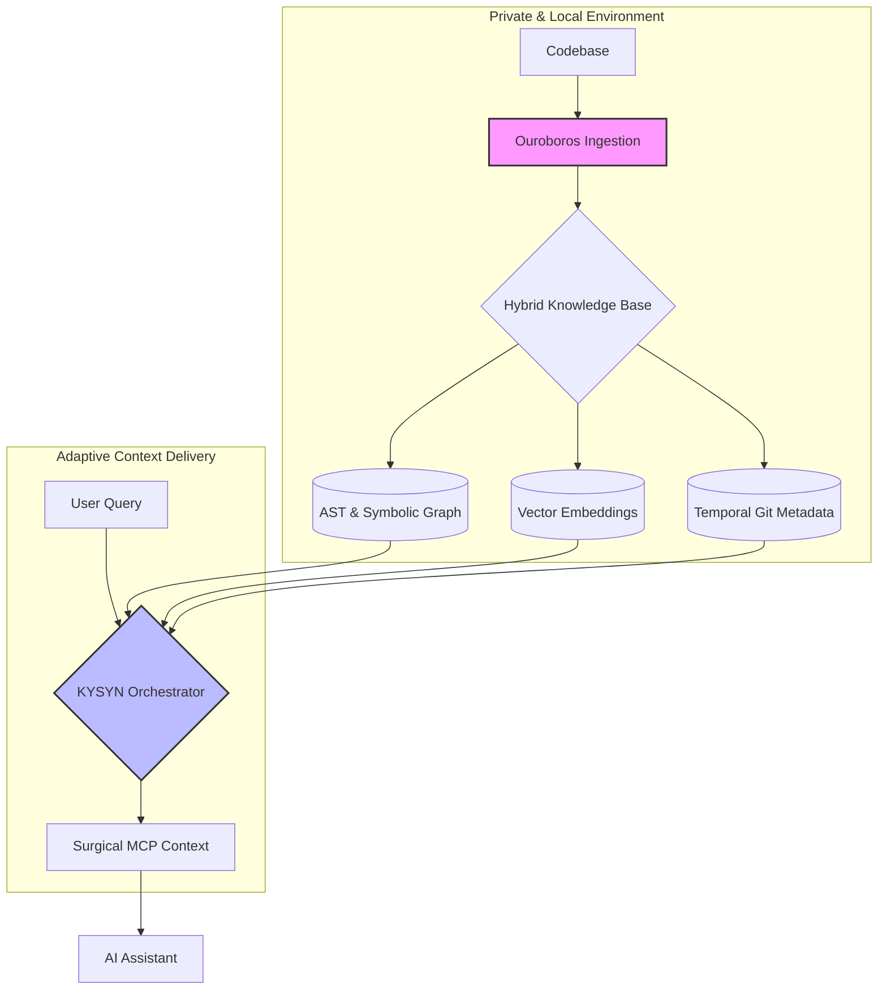

# kysyn-community
🌌 Official community hub for KYSYN. Roadmap, bug reports, and feedback for the Neural Backbone for Local Code Intelligence. Powered by the Ouroboros Protocol.

  
  

<h1 align="center">KYSYN — Powered by the Ouroboros Protocol</h1>

<strong>The Neural Backbone for Local Code Intelligence</strong>

<em>Zero Cloud. Zero Latency. Maximum Precision.</em>

  <a href="https://kysyn.dev"><strong>Official Website</strong></a> |
  <a href="#-how-to-get-help"><strong>Get Help</strong></a> |
  <a href="#-future--roadmap"><strong>Roadmap</strong></a> |
  <a href="https://kysyn.dev/buy"><strong>Buy License</strong></a>

---

## 🚀 What is KYSYN?

KYSYN is the native **MCP (Model Context Protocol)** semantic engine that transforms your local codebase into a queryable knowledge graph. Unlike common AI assistants that treat code as flat text, KYSYN understands deep structures (AST), cross-file relationships, and logical semantics.

### 🧠 Why KYSYN?
Traditional AI assistants often fail because they lack architectural awareness. KYSYN solves this by providing:
- **Surgical Precision:** Beyond vector search—Tri-Hybrid analysis (AST + Vectors + Relationship Graph).
- **Total Privacy:** Runs 100% offline on your hardware. No data ever leaves your machine.
- **Universal Integration:** As an MCP-native tool, it instantly connects to **Cursor, Claude Desktop, Zed**, and any compatible environment.

---

## 🛠️ How It Works (High-Level)

KYSYN acts as the neural infrastructure between your code and your favorite AI:

1. **Ingestion:** KYSYN parses your files locally, building an optimized SQLite-backed graph.
2. **Intelligence:** It extracts symbols, functions, and dependencies to understand "who calls what."
3. **Delivery:** It serves only the perfect, necessary context to the AI, slashing hallucinations and token waste.

---

🛠️ High-Level Architecture
KYSYN isn't just a search engine; it's a multi-layered intelligence pipeline designed to deliver surgical context to your AI. By combining AST parsing, Vector embeddings, and Graph analysis, it creates a persistent "Neural Backbone" of your local codebase.

🛰️ Intelligent Retrieval Strategies
KYSYN dynamically orchestrates its power through two distinct operational modes, ensuring the AI always has the right "altitude" of information:

🎯 Sniper Mode (Deep-Dive Precision)
Used for pinpointing exact logic and granular understanding.

Best for: Finding specific function implementations, tracing local variable dependencies, and understanding "how this exact line works."

How it works: It uses hybrid search (Vector + FTS5) to locate the target and then expands the context using Symbolic Callers to show how that specific piece is connected to its immediate surroundings.

🚁 Drone Mode (Architectural Mapping)
Used for high-level overviews and structural analysis.

Best for: Identifying legacy code clusters, planning large-scale refactorings, or untangling monolithic structures.

How it works: It bypasses granular noise and focuses on the Knowledge Graph. By extracting the top nodes via PageRank, it provides a "Skeleton Mode" view of your modules, directories, and architectural boundaries.

🧬 The Ouroboros Difference
Standard AI tools treat code as flat text. KYSYN's internal engine treats it as a living system:

Structural Awareness: Uses Tree-sitter for deep AST parsing to map every symbol and relation.

Temporal Intelligence: Factors in local Git Metadata to prioritize active code over stale logic.

Zero-Leak Policy: Every stage of the pipeline—from ingestion to retrieval—runs 100% on your local hardware.

---
## 📅 Future & Roadmap

KYSYN’s future is driven by its community. 
- 📍 **Public Roadmap:** [Link to your GitHub Projects Board]
- 💡 **Suggestions:** Open a "Feature Request" in the Issues tab to propose new capabilities.

---

## 🆘 How to Get Help

Found a bug or need technical support?
1. Check existing **Issues** to see if the problem is already being tracked.
2. Open a **New Issue** providing logs (scrubbed of sensitive data) and steps to reproduce.
3. For license or billing inquiries, please contact `support@kysyn.dev`.

---

## 🤝 Contributing

The KYSYN source code is **proprietary** and is not hosted in this repository. However, we actively encourage participation in this hub:
- Bug reporting and edge-case documentation.
- User experience feedback.
- Proposals for new tool integrations.

---

## ⚖️ Legal & Attributions

KYSYN is a local-first application committed to user privacy. 
- **Privacy:** [kysyn.dev/privacy](https://kysyn.dev/privacy)
- **Terms:** [kysyn.dev/terms](https://kysyn.dev/terms)
- **Cookies:** [kysyn.dev/cookie](https://kysyn.dev/cookie)

For a detailed list of the open-source models and libraries that power the Neural Backbone, please see our [ATTRIBUTION.md](./ATTRIBUTION.md) file.

---

## 📜 License

The content of this repository (documentation and discussions) is released under the **MIT License**.
The **KYSYN software** is distributed under the **KYSYN Commercial License** and is available for purchase at [kysyn.dev](https://kysyn.dev).

---

KYSYN is built with ❤️ by a **Solo Dev** focused on bringing high-performance AI directly to the developer's local environment. No cloud traps, no data leaks. Just pure code intelligence. 

---

© 2026 KYSYN. All rights reserved. 

